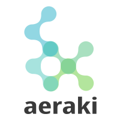

# Aeraki

A framework to help you build a service mesh that can understand any layer 7 protocols.

Aeraki [Air-rah-ki] is the Greek word for 'breeze'. While Istio connects microservices in a service mesh, Aeraki provides a framework to allow Istio to support more layer 7 protocols other than just HTTP and gRPC.

The problems that this project is trying to solve:
* Istio has limited build-in support to layer 7 protocols other than HTTP and gRPC.
* It's not feasible to add these protocols directly into Istio codes because it will make the Istio code base too complex to maintain.

To address these problems,  Aeraki works alongside Istio, providing an extendable service mesh control plane to allow the traffic management of any layer 7 protocols.

Aeraki is a standalone component in the service mesh control plane. It doesn't touch the Istio code, but leverage the EnvoyFilter API to push the needed configuration to the Envoy proxies.

Aeraki is a control plane framework for layer 7 protocol traffic management.  We plan to support the most common protocols such as [Dubbo](http://dubbo.apache.org/), [Thrift](https://thrift.apache.org/), [TARS](https://tarscloud.org/), [Redis](https://redis.io/topics/cluster-tutorial), [MySql](https://www.mysql.com/), etc. If you're using a property protocol, you can also write your own Aeraki plugin to support it in a service mesh.

Note:  
Even though Aeraki is a standalone component, it does depend on Istio xds-mcp API and the configuration format generated by Pilot. 

Feature list:
* Dubbo default routing      [working in progress]    
* Dubbo traffic splitting    [Todo]
* Dubbo header based routing [Todo]
* Redis sharding             [Todo]
* Redis traffic mirroring    [Todo]

If you're interested in contributing this project, please reach out to zhaohuabing@gmail.com