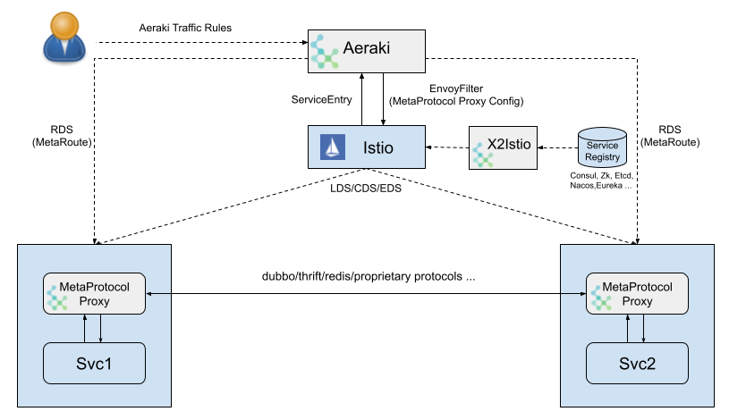

# Aeraki

# Manage any layer-7 traffic in an Istio service mesh!

---
Aeraki [Air-rah-ki] is the Greek word for 'breeze'. While Istio connects microservices in a service mesh, Aeraki provides a framework to allow Istio to support more layer-7 protocols other than just HTTP and gRPC.

## Architecture

## Problems to solve

We face some challenges in Istio traffic management:
* Istio has limited build-in support to layer 7 protocols other than HTTP and gRPC.
* It's not feasible to add these protocols directly into Istio codes because it will make the Istio code base too complex to maintain.

To address these problems,  Aeraki works alongside Istio, providing an extendable service mesh control plane to allow the traffic management of any layer 7 protocols.

Aeraki is a standalone component in the service mesh control plane. It doesn't touch the Istio code, but leverage the EnvoyFilter API to push the needed configuration to the Envoy proxies.

Aeraki is a control plane framework for layer 7 protocol traffic management.  We plan to support most of the widely used protocols such as [Dubbo](http://dubbo.apache.org/), [Thrift](https://thrift.apache.org/), [TARS](https://tarscloud.org/), [Redis](https://redis.io/topics/cluster-tutorial), [MySql](https://www.mysql.com/), etc. If you're using a proprietary protocol, you can also write your own Aeraki plugin to support it in a service mesh.

Note:  
Even though Aeraki is a standalone component, it does depend on Istio xds-mcp API and the configuration format generated by Pilot. 

## Feature list:
* Dubbo
  * [Done] Default routing
  * [Done] Version-based routing
  * [Done] Traffic splitting
  * [Done] Metrics
  * [Done] Method based routing
  * [Todo] Header based routing
* Thrift
  * [Done] Default routing
  * [Done] Version-based routing
  * [Done] Traffic splitting
  * [Done] Metrics
  * [Todo] Header based routing
  * [Todo] Rate limit
* Kafka
  * [Done] Metrics 
* ZooKeeper
  * [Done] Metrics
* Redis
  * [Working] Redis Cluster 
  * [Working] Sharding
  * [Working] Traffic mirroring
* [Planning] TARS 
* [Todo] MySql
* [Todo] MongoDB
* [Todo] Postgres
* [Todo] RocketMQ
* ...

## Demo

[Live Demo: kiali Dashboard](http://aeraki.zhaohuabing.com:20001/)

[Live Demo: Service Metrics: Grafana](http://aeraki.zhaohuabing.com:3000/d/hxSYMqbMz/aeraki-demo?orgId=1&kiosk)

[Live Demo: Service Metrics: Prometheus](http://aeraki.zhaohuabing.com:9090/new/graph?g0.expr=envoy_dubbo_inbound_20880___response_success&g0.tab=0&g0.stacked=1&g0.range_input=1h&g1.expr=envoy_dubbo_outbound_20880__org_apache_dubbo_samples_basic_api_demoservice_request&g1.tab=0&g1.stacked=1&g1.range_input=1h&g2.expr=envoy_thrift_inbound_9090___response&g2.tab=0&g2.stacked=1&g2.range_input=1h&g3.expr=envoy_thrift_outbound_9090__thrift_sample_server_thrift_svc_cluster_local_response_success&g3.tab=0&g3.stacked=1&g3.range_input=1h&g4.expr=envoy_thrift_outbound_9090__thrift_sample_server_thrift_svc_cluster_local_request&g4.tab=0&g4.stacked=1&g4.range_input=1h)

Recored Demo: Dubbo and Thrift Traffic Management

## Contact
If you're interested in contributing this project, please reach out to zhaohuabing@gmail.com
